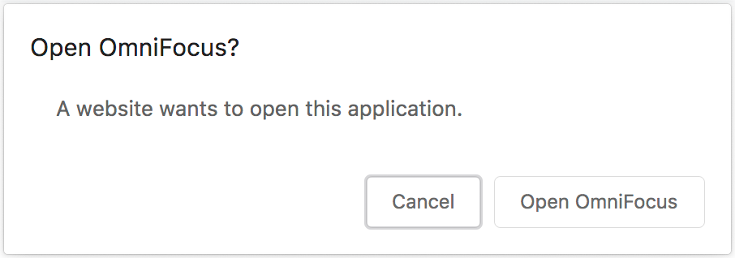

# Save to OmniFocus

Chrome extension that add a toolbar button and a context menu action to save a link to the current tab to OmniFocus.

## "A website wants to open this application" popup

When using the extension you might get this popup:



[That's a known issue.](https://superuser.com/questions/1492714/chrome-prompting-for-custom-protocol-handlers-every-time-after-update) There used to be a checkbox on that popup that allowed Chrome to remember your choice, but it was removed with Chrome 77.

A way to make that popup go away is by adding the `omnifocus://` protocol to the `[URLWhitelist](https://cloud.google.com/docs/chrome-enterprise/policies/?policy=URLWhitelist) via this command:

```
defaults write com.google.Chrome URLAllowlist -array-add 'omnifocus://*'
```

Once added, it will require a reload of Chrome policy or a restart of Chrome.  To reload the policy or confirm the setting, type `chrome://policy` in the address bar.  Click the `Reload Policy` button to reload.  If the setting is configured it will show in the `Chrome Policies` section, along with a link to the Chrome `URLAllowlist` documentation.
